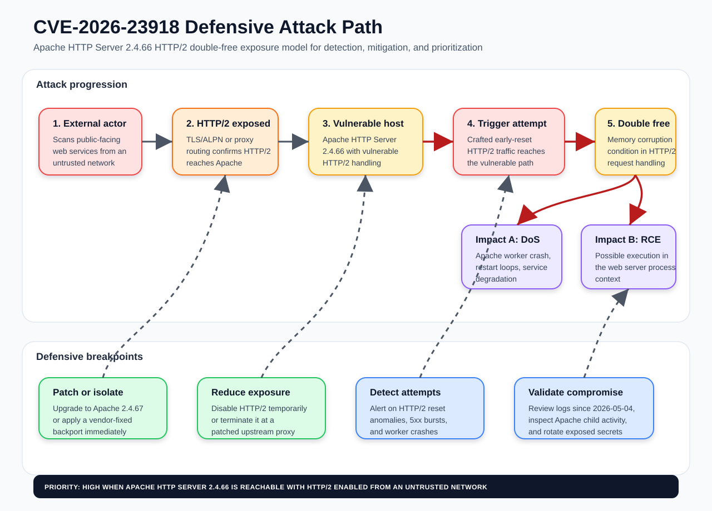
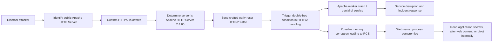

# Attack Path: CVE-2026-23918 (Apache HTTP Server HTTP/2 Double Free)

## Summary

CVE-2026-23918 is an Apache HTTP Server 2.4.66 vulnerability in HTTP/2 handling described by Apache and NVD as a double-free condition with possible remote code execution (RCE). Apache fixed the issue in Apache HTTP Server 2.4.67, released on 2026-05-04. This attack path is intended for defensive threat modeling, exposure validation, detection engineering, and remediation planning; it does not include exploit payloads or reproduction instructions.

## Source facts

| Field | Value |
| --- | --- |
| CVE | CVE-2026-23918 |
| Product | Apache HTTP Server |
| Affected version | 2.4.66 |
| Fixed version | 2.4.67 |
| Vulnerability class | CWE-415: Double Free |
| Impact | Possible RCE and denial of service through HTTP/2 handling |
| CVSS v3.1 | 8.8 High (`AV:N/AC:L/PR:L/UI:N/S:U/C:H/I:H/A:H`) |
| Disclosure / update | Apache HTTP Server 2.4.67 released on 2026-05-04 |

References:

- Apache HTTP Server 2.4 vulnerabilities: https://httpd.apache.org/security/vulnerabilities_24.html#CVE-2026-23918
- NVD CVE detail: https://nvd.nist.gov/vuln/detail/CVE-2026-23918
- CVE record: https://www.cve.org/CVERecord?id=CVE-2026-23918

## Assumptions and scope

This path models a public-facing Apache HTTP Server instance that:

1. Runs Apache HTTP Server 2.4.66.
2. Exposes HTTPS from the internet or another untrusted network zone.
3. Has HTTP/2 enabled through `mod_http2` or equivalent distribution packaging.
4. Processes requests in a context where worker crashes, memory corruption, or possible code execution would affect application availability, confidentiality, or integrity.

If any of these assumptions are false, the path should be downgraded or closed after evidence is attached to the asset record.

## Graphical attack path

Threat hunting rules based on this graph are available in [CVE-2026-23918 threat hunting rules](../threat-hunting/cve-2026-23918-rules.md).

## Defensive attack path

## Kill-chain view

| Phase | Attacker objective | Defensive observations | ATT&CK mapping |
| --- | --- | --- | --- |
| Reconnaissance | Discover internet-facing Apache services and hosts that advertise HTTP/2. | External scans, unusual TLS/ALPN probing, high request diversity from few sources. | T1595 Active Scanning |
| Vulnerability identification | Infer Apache HTTP Server 2.4.66 through headers, error pages, package inventory leaks, or internal asset data exposure. | HTTP response header collection, version disclosure, unauthenticated metadata access. | T1592 Gather Victim Host Information |
| Initial access attempt | Exercise vulnerable HTTP/2 reset handling against exposed service. | HTTP/2 reset anomalies, request spikes, abnormal connection termination patterns. | T1190 Exploit Public-Facing Application |
| Impact | Crash workers or degrade availability. | Elevated 5xx responses, worker restarts, core dumps, `segfault`, `double free`, or memory allocator errors. | T1499 Endpoint Denial of Service |
| Possible execution | Gain execution in the web server process if exploitation is reliable in the target environment. | Unexpected child processes from web server user, modified web files, outbound callbacks, suspicious module loads. | T1059 Command and Scripting Interpreter; T1105 Ingress Tool Transfer |
| Post-compromise | Access local secrets, application configs, database credentials, service tokens, or internal systems reachable from the web tier. | Reads of config files, credential use from web host, lateral movement from DMZ/web subnet. | T1552 Unsecured Credentials; T1021 Remote Services |

## Preconditions to verify

- [ ] Asset runs Apache HTTP Server 2.4.66.
- [ ] HTTP/2 is enabled and reachable from an untrusted source.
- [ ] The asset is internet-facing or reachable from a lower-trust network.
- [ ] There is no compensating control that terminates HTTP/2 before traffic reaches vulnerable Apache.
- [ ] Runtime or package evidence confirms the host has not been upgraded to Apache HTTP Server 2.4.67 or a vendor-patched backport.

## Detection opportunities

### Network and edge telemetry

- Alert on sudden increases in HTTP/2 stream resets, connection resets, or malformed/aborted HTTP/2 sessions against Apache-backed virtual hosts.
- Compare ALPN negotiation rates before and after the advisory date; anomalous HTTP/2 probing can indicate vulnerability discovery.
- Correlate edge proxy 502/503/504 bursts with Apache worker restarts on the backend.

### Host telemetry

- Monitor Apache error logs, system logs, and crash handlers for worker crashes, memory allocator errors, segmentation faults, or core dump creation.
- Alert on new processes spawned by the Apache service account outside the expected process tree.
- Monitor unexpected changes under web roots, Apache module directories, cron locations, systemd unit paths, and application configuration directories.

### Inventory telemetry

- Query package managers, container manifests, SBOMs, and runtime banners for Apache HTTP Server 2.4.66.
- Flag container images derived from default Apache HTTP Server 2.4.66 images until rebuilt on a fixed base image.
- Prioritize assets with direct internet exposure, privileged network reachability, sensitive credentials on disk, or high business criticality.

## Mitigation and response

1. Upgrade Apache HTTP Server to 2.4.67 or apply the vendor-supplied package update that backports the fix.
2. If immediate patching is not possible, temporarily disable HTTP/2 on affected Apache instances or terminate HTTP/2 at a patched upstream proxy that forwards only safe protocols to Apache.
3. Remove version disclosure from response headers and error pages to reduce opportunistic targeting, while recognizing this is not a substitute for patching.
4. Restart Apache after patching and verify the running binary/package version, not only the installed package state.
5. Review logs from 2026-05-04 onward for crash loops, suspicious HTTP/2 reset behavior, and unexpected activity by the Apache service account.
6. If compromise is suspected, rotate credentials accessible to the web server process and inspect adjacent systems reachable from the web tier.

## Validation evidence to attach

| Evidence | Purpose |
| --- | --- |
| Package query or container digest | Confirms affected/fixed Apache build. |
| Apache runtime version output | Confirms the active binary after restart. |
| HTTP/2 configuration snippet | Confirms whether the vulnerable code path is exposed. |
| Edge proxy configuration | Confirms whether HTTP/2 reaches Apache or terminates before it. |
| Log excerpt or SIEM query result | Confirms attempted exploitation, crash evidence, or absence of indicators. |

## Prioritization guidance

Treat this path as high priority when Apache HTTP Server 2.4.66 is externally reachable with HTTP/2 enabled. Prioritize remediation ahead of lower-exposure systems because the CVSS vector indicates network reachability, low attack complexity, no user interaction, and high confidentiality, integrity, and availability impact. Downgrade only when evidence shows the Apache instance is not 2.4.66, has a vendor-fixed backport, or does not receive HTTP/2 traffic from untrusted networks.
