# Dirty Frag attack path and GraphQL attack graph

## Purpose

This document models Dirty Frag as a **defender-focused attack path** from an existing Linux foothold to root-level objectives. It does not describe exploit internals or provide weaponization steps. The goal is to help detection engineers, threat hunters, and incident responders reason about prerequisites, likely telemetry, controls, and investigation pivots.

The structured attack graph is stored in [`attack_graph/dirtyfrag_attack_graph.json`](../attack_graph/dirtyfrag_attack_graph.json), described by [`attack_graph/schema.graphql`](../attack_graph/schema.graphql), and queryable with [`attack_graph/query.graphql`](../attack_graph/query.graphql).

## Attack path narrative

1. **Initial low-privileged foothold:** The actor starts with local code execution through SSH, web-shell access, a service account, a CI runner, or a container workload.
2. **Interactive shell and discovery:** The actor determines account context, kernel version, writable locations, and host role.
3. **Dirty Frag-relevant exposure:** The target has relevant Linux networking functionality exposed, such as `esp4`, `esp6`, or `rxrpc`, and the booted kernel has not been remediated by the vendor.
4. **Local artifact staging:** The actor writes and executes a local ELF-style artifact from a writable location. Microsoft reported an observed artifact named `./update`; defenders should hunt behavior rather than rely on that filename.
5. **Local privilege-escalation attempt:** The actor attempts Dirty Frag privilege escalation from the local foothold. This repository intentionally models only the attack stage and telemetry, not exploit mechanics.
6. **Root context:** If successful, the actor obtains root context or launches root-owned processes.
7. **Post-escalation objectives:** Root access enables GLPI/PHP session tampering, credential and secret access, persistence, defense evasion, data theft, or lateral movement.
8. **Controls and detections:** Vendor kernel patching, module policy, shell-access reduction, KQL/Sigma/osquery hunts, and host triage break or observe parts of the graph.

## GraphQL schema and query

The schema defines `AttackGraph`, `AttackNode`, and `AttackEdge` types so the attack path can be consumed by a GraphQL service or transformed into a visualization pipeline.

```graphql
query DirtyFragAttackGraph {
  dirtyFragAttackGraph {
    id
    name
    nodes {
      id
      label
      kind
      attackTechniques
      evidence
    }
    edges {
      source
      target
      kind
      label
      confidence
    }
  }
}
```

Suggested resolver behavior:

- `dirtyFragAttackGraph` returns the JSON document from `attack_graph/dirtyfrag_attack_graph.json`.
- `attackNode(id: ID!)` returns a single node from the same graph.
- Visualization layers can group nodes by `kind`, draw solid arrows for `ENABLES`, `REQUIRES`, and `LEADS_TO`, and draw dashed arrows for `DETECTED_BY` and `MITIGATED_BY`.

## Mermaid visualization

The same graph is rendered as Mermaid in [`attack_graph/dirtyfrag_attack_graph.mmd`](../attack_graph/dirtyfrag_attack_graph.mmd). GitHub and many Markdown tools can preview Mermaid directly.

```mermaid
flowchart LR
  n1_external_foothold["Initial low-privileged foothold"]
  n2_interactive_shell["Interactive shell and host discovery"]
  n3_module_exposure["Dirty Frag-relevant module exposure"]
  n4_local_artifact_staging["Local exploit artifact staged"]
  n5_dirtyfrag_lpe_attempt["Dirty Frag local privilege escalation attempt"]
  n6_root_context["Root context obtained"]
  n7_session_and_glpi_tampering["GLPI and PHP session tampering"]
  n8_credential_and_data_access["Credential and sensitive data access"]
  n9_patch_and_module_controls["Patch and module controls"]
  n10_hunting_and_response["Hunting and response analytics"]
  n1_external_foothold -->|foothold enables shell execution| n2_interactive_shell
  n2_interactive_shell -->|actor validates vulnerable host conditions| n3_module_exposure
  n2_interactive_shell -->|actor stages local artifact| n4_local_artifact_staging
  n3_module_exposure -->|vulnerable/local exposure is a precondition| n5_dirtyfrag_lpe_attempt
  n4_local_artifact_staging -->|local artifact launches escalation attempt| n5_dirtyfrag_lpe_attempt
  n5_dirtyfrag_lpe_attempt -->|successful local exploit yields root| n6_root_context
  n6_root_context -->|root enables application/session tampering| n7_session_and_glpi_tampering
  n6_root_context -->|root enables sensitive data access| n8_credential_and_data_access
  n9_patch_and_module_controls -.->|patching and module policy reduce exposure| n3_module_exposure
  n10_hunting_and_response -.->|staging hunts detect suspicious local artifact execution| n4_local_artifact_staging
  n10_hunting_and_response -.->|file hunts detect GLPI/PHP session tampering| n7_session_and_glpi_tampering
  n10_hunting_and_response -.->|PoC and osquery detect module exposure| n3_module_exposure

  classDef access fill:#d8ecff,stroke:#2b6cb0,color:#1a365d
  classDef risk fill:#ffe8cc,stroke:#c05621,color:#7b341e
  classDef impact fill:#fed7d7,stroke:#c53030,color:#742a2a
  classDef control fill:#d9f99d,stroke:#3f6212,color:#365314
  class n1_external_foothold,n2_interactive_shell,n4_local_artifact_staging access
  class n3_module_exposure,n5_dirtyfrag_lpe_attempt,n6_root_context risk
  class n7_session_and_glpi_tampering,n8_credential_and_data_access impact
  class n9_patch_and_module_controls,n10_hunting_and_response control
```



## Presentation-ready SVG visualization

A 16:9 SVG version is checked in at [`attack_graph/dirtyfrag_attack_graph.svg`](../attack_graph/dirtyfrag_attack_graph.svg) for executive briefings, slide decks, and architecture reviews. It uses the same JSON graph data as the Mermaid artifact, groups nodes by access/execution, exposure/escalation, post-escalation impact, and controls/detection, and includes a defensive-use footer that explicitly excludes exploit mechanics.

## Render locally

Use the renderer to regenerate Mermaid, create the slide-ready SVG, or create Graphviz DOT output from the JSON graph:

```bash
python3 scripts/render_attack_graph.py --format mermaid > attack_graph/dirtyfrag_attack_graph.mmd
python3 scripts/render_attack_graph.py --format svg > attack_graph/dirtyfrag_attack_graph.svg
python3 scripts/render_attack_graph.py --format dot > attack_graph/dirtyfrag_attack_graph.dot
```

The generated DOT can be converted to an image if Graphviz is installed:

```bash
dot -Tsvg attack_graph/dirtyfrag_attack_graph.dot > attack_graph/dirtyfrag_attack_graph.graphviz.svg
```

## Node-to-detection mapping

| Graph node | Detection or validation content |
| --- | --- |
| Initial foothold / interactive shell | `detections/kql/dirtyfrag_ssh_staging_to_root_transition.kql` |
| Module exposure | `dirtyfrag_poc.py`, `detections/osquery/dirtyfrag_exposure.sql`, `detections/kql/dirtyfrag_module_activity.kql` |
| Local artifact staging | `detections/kql/dirtyfrag_ssh_staging_to_root_transition.kql`, `detections/sigma/linux_dirtyfrag_post_exploitation.yml` |
| Root context | `detections/kql/dirtyfrag_ssh_staging_to_root_transition.kql` |
| GLPI/PHP session tampering | `detections/kql/dirtyfrag_glpi_php_session_tampering.kql`, `detections/sigma/linux_dirtyfrag_file_activity.yml` |
| Credential and sensitive data access | `docs/intel-assessment-dirtyfrag.md` triage guidance and host timeline review |
| Patch/module controls | `README.md` mitigation guidance and vendor kernel advisory validation |

## Analysis notes

- Treat the graph as a hypothesis model. It shows plausible transitions and detection pivots, not proof that each transition occurred.
- Confirm exploitation with process ancestry, user/session context, file evidence, module exposure, kernel patch state, and host timeline correlation.
- The graph is intentionally safe for defensive planning and omits exploit primitives, kernel memory corruption details, payload construction, and privilege-escalation code.
