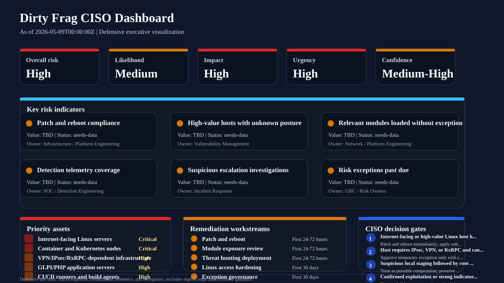

# Dirty Frag CISO and enterprise risk assessment

## Executive decision brief

Dirty Frag is an actively investigated Linux local privilege-escalation risk disclosed by Microsoft on May 8, 2026. It affects vulnerable kernel networking and memory-fragment handling paths involving `esp4`, `esp6`, and `rxrpc`, with CVE-2026-43284 associated with ESP/XFRM and CVE-2026-43500 associated with RxRPC. Microsoft reports that the issue is **post-compromise**: an attacker must first obtain local execution through a compromised account, SSH access, web shell, service account, container foothold, or similar path before attempting escalation.

For executive risk owners, the key concern is not initial compromise by itself but the **blast-radius expansion** that follows a successful privilege escalation. A low-privileged foothold on a Linux server can become root, enabling credential theft, log tampering, application session manipulation, security control disablement, persistence, lateral movement, and data access.

## CISO risk rating

| Dimension | Rating | Rationale |
| --- | --- | --- |
| Overall enterprise risk | High | Dirty Frag can convert a limited Linux foothold into root on affected systems, materially increasing host takeover and downstream data-access risk. |
| Likelihood | Medium | Exploitation requires existing local code execution, but Microsoft reports limited in-the-wild activity and public proof-of-concept activity. |
| Impact | High | Root access can expose secrets, application data, credentials, logs, security tooling, and lateral movement paths. |
| Urgency | High | Microsoft describes active investigation and limited observed activity; kernel remediation and compensating controls should be prioritized. |
| Confidence | Medium-High | Microsoft provides concrete affected components, exploitation scenarios, observed behaviors, and mitigation guidance, while RxRPC patch/advisory status may continue changing. |

Recommended executive posture: **treat Dirty Frag as a high-priority post-compromise amplifier** for Linux estates, especially internet-facing workloads, container hosts, VPN/IPsec infrastructure, GLPI/PHP application servers, CI/CD runners, and high-value systems that store credentials or sensitive data.

## Business impact analysis

| Business risk | Potential impact | Priority |
| --- | --- | --- |
| Privileged host takeover | Low-privileged Linux access becomes root, enabling full host control. | Critical |
| Credential and secret exposure | Root can read local secrets, application configuration, tokens, SSH material, LDAP settings, and session data. | Critical |
| Application integrity loss | Attackers can modify application files, authentication settings, sessions, or web content. | High |
| Defense evasion and forensic degradation | Root can delete sessions, alter logs, disable agents, and modify evidence. | High |
| Lateral movement | Compromised Linux hosts can become staging points into adjacent systems, identity stores, and management planes. | High |
| Operational disruption | Emergency patching, reboots, cache clearing, and module disablement can affect VPN/IPsec/RxRPC-dependent services. | Medium-High |
| Regulatory and contractual exposure | Data access or integrity loss can trigger incident-notification and customer-reporting obligations. | Context-dependent |

## Scope and asset prioritization

Prioritize assessment and remediation for the following asset classes:

1. **Internet-facing Linux servers** with SSH, web applications, remote administration, or exposed management planes.
2. **Container hosts and Kubernetes/OpenShift nodes** where a container foothold could become host-level execution.
3. **VPN, IPsec, and network-security hosts** that may legitimately rely on `esp4`, `esp6`, XFRM, or related modules.
4. **Application servers with session-rich workloads**, especially GLPI/PHP stacks or other systems storing session files locally.
5. **CI/CD runners and build agents** where untrusted code may gain local execution.
6. **Privileged infrastructure systems** such as bastions, jump hosts, secrets brokers, identity connectors, monitoring servers, and backup infrastructure.
7. **Legacy or slow-to-reboot Linux hosts** where kernel updates are often installed but not booted.

## Risk scenarios

### Scenario 1: Compromised SSH account escalates to root

- **Path:** Valid SSH credentials or a weak account provide shell access. The actor stages a local binary, exploits Dirty Frag, and obtains root.
- **Business consequence:** Host takeover, credential exposure, persistence, lateral movement, and potential loss of forensic integrity.
- **Controls to verify:** MFA or conditional access for administrative access, SSH hardening, least privilege, EDR telemetry, patched booted kernel, SUID/SGID monitoring.

### Scenario 2: Web-shell foothold on an application server

- **Path:** A vulnerable web application or uploaded shell gives the actor low-privileged execution. Dirty Frag enables root on the host.
- **Business consequence:** Application data theft, session tampering, file modification, and higher likelihood of customer-impacting incident response.
- **Controls to verify:** Web application patching, file integrity monitoring, web process restrictions, egress controls, PHP session monitoring, root transition detections.

### Scenario 3: Container workload breaks into host context

- **Path:** A compromised container or misconfigured workload provides host-level execution or sufficient local access. Dirty Frag is attempted against the host kernel.
- **Business consequence:** Multi-tenant workload risk, cluster node compromise, secrets access, and possible control-plane pivoting.
- **Controls to verify:** Container hardening, privileged-container restrictions, host namespace restrictions, node patching, runtime detection, admission control.

### Scenario 4: Network infrastructure with legitimate module dependency

- **Path:** A VPN/IPsec or RxRPC-dependent server cannot immediately disable affected modules because doing so would break business services.
- **Business consequence:** Extended exposure window and difficult mitigation tradeoffs.
- **Controls to verify:** Accelerated maintenance window, compensating access restrictions, increased monitoring, vendor patch tracking, rollback planning, business-owner signoff.

## Control objectives

| Control objective | Required outcome | Executive owner |
| --- | --- | --- |
| Patch and reboot vulnerable Linux systems | Vendor-fixed kernels are installed and hosts are booted into the fixed version. | Infrastructure / Platform Engineering |
| Reduce exploitable local access | Unnecessary SSH, shell, service-account, CI runner, and web-shell paths are removed or constrained. | Infrastructure / Application Owners |
| Limit module exposure | Unused `rxrpc`, `esp4`, `esp6`, and related module paths are disabled only where operationally safe. | Network / Platform Engineering |
| Detect post-compromise escalation | Security telemetry identifies suspicious local staging, root transition, SUID/SGID activity, module changes, and application/session tampering. | SOC / Detection Engineering |
| Protect high-value data and secrets | Root compromise of one host does not automatically expose broad credentials, tokens, backup data, or identity material. | Security Architecture / IAM |
| Validate incident integrity | Confirmed or suspected exploitation triggers host timeline review, evidence preservation, and integrity checks before disruptive cleanup. | Incident Response |

## 30/60/90-day action plan

### First 24-72 hours

- Inventory Linux assets and identify hosts with exposed SSH, internet-facing web apps, containers, CI/CD runners, VPN/IPsec, RxRPC/AFS, GLPI, and PHP session workloads.
- Use vendor advisories, vulnerability management, and the repository PoC to identify hosts with relevant module exposure and patch gaps.
- Prioritize emergency patching and reboot validation for internet-facing and high-value Linux systems.
- Confirm whether `esp4`, `esp6`, and `rxrpc` are required; disable unused modules only after business-owner validation.
- Deploy or adapt the included KQL, Sigma, and osquery hunts for staging, root transition, module activity, GLPI/PHP session tampering, and SUID/SGID anomalies.
- Open an incident-response watch window for suspicious Linux privilege-escalation activity.

### First 30 days

- Complete patch and reboot compliance for prioritized Linux estates.
- Implement stricter SSH and shell-access controls for non-admin users, service accounts, and automation accounts.
- Review container-host hardening, privileged container usage, hostPath mounts, namespace exposure, and node patch cadence.
- Validate telemetry coverage: process creation, file activity, module activity, auth logs, package/kernel inventory, and EDR health.
- Run tabletop triage for suspected Dirty Frag exploitation, including evidence preservation and host rebuild criteria.

### 60 days

- Reduce standing privileges on Linux administrative paths and enforce short-lived access patterns where possible.
- Improve application secret isolation so root on one application host does not expose broad enterprise credentials.
- Tune detections for environment-specific false positives, including approved IPsec/VPN/RxRPC hosts and legitimate GLPI maintenance.
- Establish dashboards for vulnerable kernel drift, reboot debt, exposed modules, and privileged Linux shell usage.

### 90 days

- Embed kernel emergency patch SLAs into platform governance.
- Mature Linux attack-path management by linking vulnerability posture, identity exposure, remote access, container risk, and crown-jewel data mapping.
- Validate resilience through purple-team or detection-validation exercises that simulate post-compromise escalation behavior without exploit code.
- Report residual Dirty Frag-style risk to the risk committee with remaining exceptions, compensating controls, and business-owner approvals.

## Board and risk committee reporting language

Suggested concise update:

> Dirty Frag is a Linux local privilege-escalation issue that can turn an existing low-privileged foothold into root access on affected hosts. It is not an initial-access vulnerability, but it materially increases the impact of compromised SSH accounts, web shells, containers, service accounts, and CI/CD runners. Our immediate priorities are patching and reboot validation, reducing unnecessary local shell access, safely disabling unused vulnerable modules, and monitoring for suspicious local staging and root-transition behavior.

Suggested risk acceptance language for exceptions:

> This exception accepts temporary exposure to Dirty Frag-style local privilege escalation on the named Linux assets because immediate module disablement or reboot would disrupt business-critical services. The exception is time-bound, requires business-owner approval, increased monitoring, compensating access restrictions, and a committed remediation date.

## Key risk indicators

Track these KRIs until remediation is complete:

- Number and percentage of Linux hosts not booted into a vendor-remediated kernel.
- Number of internet-facing Linux hosts with vulnerable or unknown kernel posture.
- Number of high-value Linux hosts with `esp4`, `esp6`, or `rxrpc` loaded or loadable without documented business need.
- Number of Linux hosts with recent suspicious local executable staging in writable directories.
- Number of privilege-transition detections involving `su`, `sudo`, `pkexec`, SUID/SGID launches, or root-owned children after low-privileged shell activity.
- Mean time to patch and reboot Linux critical vulnerabilities.
- Percentage of Linux assets with complete process, file, auth, module, and kernel inventory telemetry.
- Number of accepted exceptions past due date.

## Decision matrix

| Condition | Recommended decision |
| --- | --- |
| Internet-facing or high-value Linux host is vulnerable or unknown | Patch and reboot immediately; apply enhanced monitoring until validated. |
| Host requires IPsec/VPN/RxRPC and cannot disable modules | Keep service running only with business-owner approval, compensating access controls, and expedited kernel remediation. |
| Host does not require affected modules | Disable unused modules as temporary mitigation and still patch/reboot. |
| Suspicious staging plus root transition is observed | Treat as possible compromise; preserve evidence, isolate as appropriate, and run full incident response. |
| Confirmed exploitation or strong indicators | Treat as full host compromise; validate application integrity, credentials, persistence, and downstream access. |

## Residual risk statement

Residual risk remains until all affected Linux hosts are confirmed patched, rebooted, monitored, and free of suspicious post-compromise activity. Because Dirty Frag is a post-compromise amplifier, organizations should also reduce local-execution opportunities and harden identity, application, and container paths that could provide the prerequisite foothold.

## Embedded CISO dashboard visualization

The operational dashboard below is embedded from [`dashboards/dirtyfrag_ciso_dashboard.json`](../dashboards/dirtyfrag_ciso_dashboard.json) so this assessment can be read as a standalone executive packet. The slide-ready visualization is checked in as [`dashboards/dirtyfrag_ciso_dashboard.svg`](../dashboards/dirtyfrag_ciso_dashboard.svg), and the styled HTML view is available at [`dashboards/dirtyfrag_ciso_dashboard.html`](../dashboards/dirtyfrag_ciso_dashboard.html). Regenerate the visual artifact with `python3 scripts/render_ciso_dashboard.py --format svg --output dashboards/dirtyfrag_ciso_dashboard.svg` and the HTML artifact with `python3 scripts/render_ciso_dashboard.py`.



### Executive risk posture tiles

```text
+----------------+----------------+----------------+----------------+----------------+
| Overall risk   | Likelihood     | Impact         | Urgency        | Confidence     |
+----------------+----------------+----------------+----------------+----------------+
| High           | Medium         | High           | High           | Medium-High    |
+----------------+----------------+----------------+----------------+----------------+
```

> Dirty Frag is a post-compromise Linux local privilege-escalation risk that can expand a low-privileged foothold into root access on vulnerable systems. CISO priorities are kernel patch/reboot validation, local-access reduction, safe module exposure reduction, and post-compromise detection coverage.

### KRI dashboard cards

| KRI | Current value | Target | Status | Owner |
| --- | --- | --- | --- | --- |
| Patch and reboot compliance | TBD | >= 95% prioritized Linux assets booted into remediated kernels | needs-data | Infrastructure / Platform Engineering |
| High-value hosts with unknown posture | TBD | 0 internet-facing or crown-jewel Linux hosts with unknown kernel posture | needs-data | Vulnerability Management |
| Relevant modules loaded without exception | TBD | 0 unauthorized esp4, esp6, or rxrpc exposures | needs-data | Network / Platform Engineering |
| Detection telemetry coverage | TBD | >= 90% prioritized hosts reporting process, file, auth, module, and kernel inventory telemetry | needs-data | SOC / Detection Engineering |
| Suspicious escalation investigations | TBD | All staging-to-root-transition alerts triaged within incident SLA | needs-data | Incident Response |
| Risk exceptions past due | TBD | 0 overdue Dirty Frag exceptions | needs-data | GRC / Risk Owners |

### Priority asset segment visualization

| Asset segment | Priority | Required action |
| --- | --- | --- |
| Internet-facing Linux servers | Critical | Patch and reboot first; verify shell-access controls and detection coverage. |
| Container and Kubernetes nodes | Critical | Validate node kernel posture, privileged container controls, host namespace restrictions, and runtime telemetry. |
| VPN/IPsec/RxRPC-dependent infrastructure | High | Coordinate maintenance windows, document exceptions, and increase monitoring. |
| GLPI/PHP application servers | High | Enable file/session monitoring and validate application integrity after suspected escalation. |
| CI/CD runners and build agents | High | Restrict runner privileges, isolate workloads, and verify rapid patch cadence. |

### Remediation workstream tracker

| Workstream | Phase | Status | Success measure |
| --- | --- | --- | --- |
| Patch and reboot | First 24-72 hours | not-started | Prioritized Linux systems are booted into vendor-remediated kernels. |
| Module exposure review | First 24-72 hours | not-started | Unused esp4, esp6, and rxrpc exposure is blocked or has approved business exceptions. |
| Threat hunting deployment | First 24-72 hours | not-started | KQL, Sigma, and osquery hunts are deployed or mapped to equivalent telemetry. |
| Linux access hardening | First 30 days | not-started | Unnecessary SSH, shell, service-account, and automation access paths are reduced. |
| Exception governance | First 30 days | not-started | All delayed patching or module-disablement exceptions are time-bound and owner-approved. |

### CISO decision gate visualization

| Condition | CISO decision |
| --- | --- |
| Internet-facing or high-value Linux host has vulnerable or unknown kernel posture | Patch and reboot immediately; apply enhanced monitoring until validated. |
| Host requires IPsec, VPN, or RxRPC and cannot disable modules | Approve temporary exception only with compensating access controls, monitoring, and committed remediation date. |
| Suspicious local staging followed by root transition is observed | Treat as possible compromise; preserve evidence, isolate as appropriate, and run incident response. |
| Confirmed exploitation or strong indicators exist | Treat as full host compromise and validate application integrity, credentials, persistence, and downstream access. |

### Dashboard data feeds

- Vulnerability management kernel inventory
- EDR process and file telemetry
- Linux auth logs and SSH session records
- Module exposure checks from dirtyfrag_poc.py or osquery
- KQL/Sigma/osquery Dirty Frag hunting content
- GRC exception register

## Appendix: relationship to repository artifacts

| Need | Repository artifact |
| --- | --- |
| Exposure validation | `dirtyfrag_poc.py` |
| Executive attack path | `docs/attack-path-dirtyfrag.md`, `attack_graph/dirtyfrag_attack_graph.mmd`, and the 16:9 presentation SVG `attack_graph/dirtyfrag_attack_graph.svg` |
| Visual threat model | `docs/threat-model-dirtyfrag.md`, `threat_model/dirtyfrag_threat_model.svg`, and `threat_model/dirtyfrag_threat_model.json` |
| Threat intelligence and hunting detail | `docs/intel-assessment-dirtyfrag.md` |
| Detection engineering | `detections/kql/`, `detections/sigma/`, `detections/osquery/` |
| Validation tests | `tests/` |
