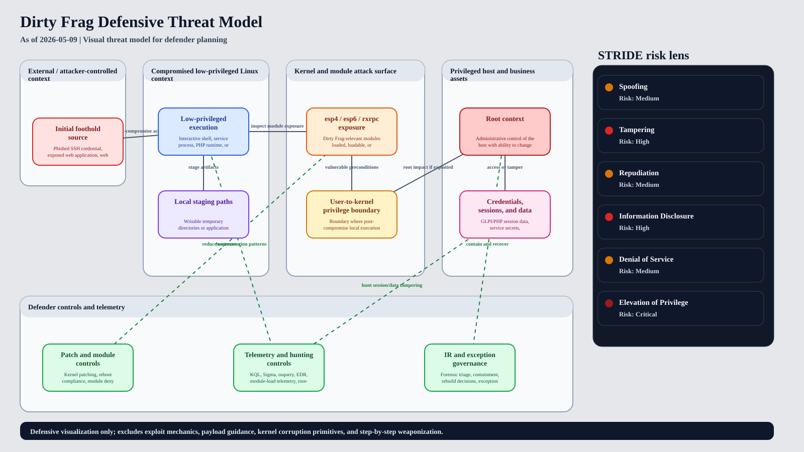

# Dirty Frag visual threat model

This document provides a defender-focused threat model for the Dirty Frag post-compromise Linux local privilege-escalation risk described by Microsoft. It is designed for architecture review, security leadership briefings, tabletop exercises, and detection engineering planning.

The threat model is intentionally non-exploitative. It visualizes trust zones, data flows, STRIDE threat categories, and defensive controls without documenting exploit mechanics, kernel corruption primitives, payloads, or weaponization steps.

## Visualization artifacts

- Slide-ready SVG: [`threat_model/dirtyfrag_threat_model.svg`](../threat_model/dirtyfrag_threat_model.svg)
- Mermaid source: [`threat_model/dirtyfrag_threat_model.mmd`](../threat_model/dirtyfrag_threat_model.mmd)
- Structured model data: [`threat_model/dirtyfrag_threat_model.json`](../threat_model/dirtyfrag_threat_model.json)
- Renderer: [`scripts/render_threat_model.py`](../scripts/render_threat_model.py)



## Model scope

Dirty Frag is modeled as a **post-compromise escalation risk**. The model starts after an adversary has gained local code execution through a low-privileged account, exposed web application, web shell, compromised container workload, or comparable foothold. It then traces how exposed `esp4`, `esp6`, or `rxrpc` kernel-module paths can affect the user-to-kernel privilege boundary and lead to root-level business impact if vulnerability prerequisites align.

The model supports three defensive questions:

1. **Where are the trust boundaries?** The key boundary is between low-privileged local execution and the kernel/module surface.
2. **Which STRIDE risks matter most?** Elevation of privilege is critical, with tampering and information disclosure carrying high business impact after root.
3. **Which controls reduce risk?** Patch/reboot, module governance, least privilege, telemetry coverage, hunting rules, and incident-response governance are mapped directly to the modeled flows.

## Trust zones

| Zone | Defensive meaning |
| --- | --- |
| External / attacker-controlled context | Untrusted sources such as stolen credentials, internet-facing applications, or web shell operators before local execution. |
| Compromised low-privileged Linux context | User, service, PHP runtime, or container execution that is already inside the host but not root. |
| Kernel and module attack surface | Dirty Frag-relevant kernel and module conditions, especially `esp4`, `esp6`, and `rxrpc` exposure and module-loading policy. |
| Privileged host and business assets | Root context, credentials, application data, GLPI/PHP session stores, service secrets, and lateral-movement opportunities. |
| Defender controls and telemetry | Preventive, detective, and responsive capabilities that reduce, observe, or contain the modeled risk. |

## STRIDE assessment summary

| STRIDE category | Risk | Why it matters |
| --- | --- | --- |
| Spoofing | Medium | Stolen credentials or abused service identities can provide the local foothold required before Dirty Frag is relevant. |
| Tampering | High | Root access can allow modification of sessions, application state, security tooling, logs, and configuration. |
| Repudiation | Medium | Weak process lineage, missing logs, or response delays can make escalation timelines difficult to prove. |
| Information disclosure | High | Root-level access can expose credentials, secrets, session data, kernel posture, and sensitive business data. |
| Denial of service | Medium | Emergency reboots, containment actions, kernel instability, or incompatible module mitigations can disrupt services. |
| Elevation of privilege | Critical | A low-privileged local actor can become root if affected kernel paths and exploit prerequisites are present. |

## Control mapping

| Control | Priority | Type | Primary modeled effect |
| --- | --- | --- | --- |
| Patch and reboot affected kernels | P0 | Preventive | Removes vulnerable kernel exposure once vendor fixes are available and active after reboot. |
| Disable or deny unused `esp4`, `esp6`, and `rxrpc` modules after dependency review | P0 | Preventive | Reduces reachable module surface where operational dependencies permit. |
| Reduce unnecessary SSH, shell, sudo, and container escape blast radius | P1 | Preventive | Lowers the number and impact of local footholds that can attempt privilege escalation. |
| Deploy Dirty Frag KQL, Sigma, and osquery hunts from this repository | P1 | Detective | Improves visibility into suspicious staging, module activity, root transitions, and session tampering. |
| Alert on unexpected module load, unload, and inspection activity | P1 | Detective | Surfaces activity around Dirty Frag-relevant exposure conditions and attacker discovery behavior. |
| Investigate suspicious GLPI/PHP session modification patterns | P1 | Detective | Connects post-escalation business-impact activity to host and application evidence. |
| Preserve evidence, contain suspected hosts, rotate secrets, and rebuild when integrity is uncertain | P0 | Responsive | Limits impact when root compromise cannot be ruled out. |

## Regenerating the visualization

Regenerate the Mermaid visualization:

```bash
python3 scripts/render_threat_model.py --format mermaid --output threat_model/dirtyfrag_threat_model.mmd
```

Regenerate the slide-ready SVG visualization:

```bash
python3 scripts/render_threat_model.py --format svg --output threat_model/dirtyfrag_threat_model.svg
```

## How to use this in presentation and review

- Use the SVG as a single-slide architecture view for CISO, risk committee, or incident-response tabletop discussions.
- Use the STRIDE panel to explain why Dirty Frag is primarily an elevation-of-privilege risk but still creates downstream tampering, disclosure, and availability concerns.
- Use the control mapping to connect executive actions to technical workstreams in the CISO dashboard and detection content.
- Use the JSON model as the source of truth when updating zones, flows, threats, or controls.

## Related repository artifacts

- CISO assessment: [`docs/ciso-risk-assessment-dirtyfrag.md`](ciso-risk-assessment-dirtyfrag.md)
- CISO dashboard: [`docs/ciso-dashboard-dirtyfrag.md`](ciso-dashboard-dirtyfrag.md)
- Attack path: [`docs/attack-path-dirtyfrag.md`](attack-path-dirtyfrag.md)
- Intelligence assessment: [`docs/intel-assessment-dirtyfrag.md`](intel-assessment-dirtyfrag.md)
- Safe exposure PoC: [`dirtyfrag_poc.py`](../dirtyfrag_poc.py)
- Hunting rules: [`detections/`](../detections/)
